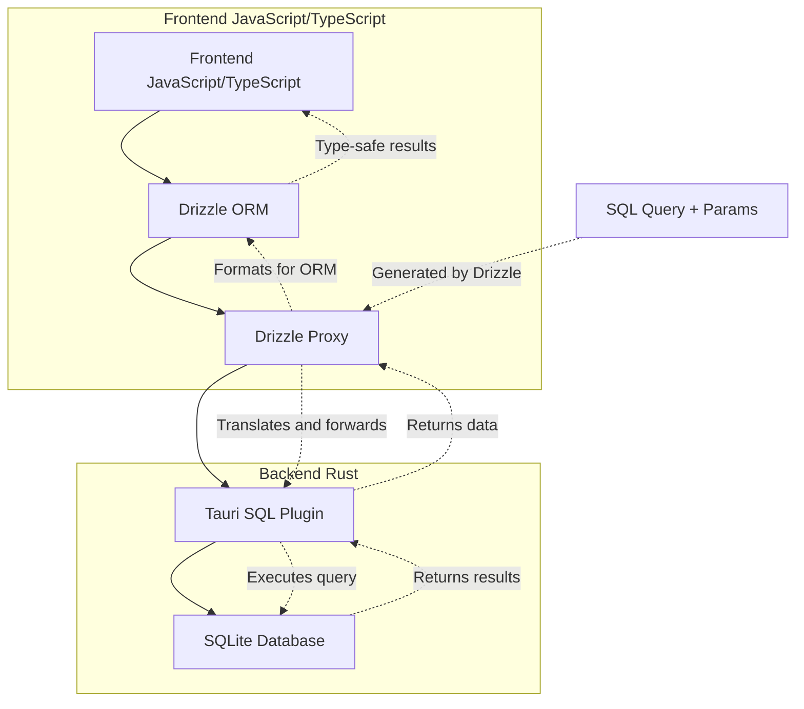

GitHub: https://github.com/HuakunShen/tauri-demo/tree/master/examples/drizzle-sqlite-proxy

> [!info]
> This demo let you use drizzle to control your sqlite DB in a Tauri app, without any sidecar.
> This is a Tauri v2 reproduction for the archived repo [https://github.com/tdwesten/tauri-drizzle-sqlite-proxy-demo](https://github.com/tdwesten/tauri-drizzle-sqlite-proxy-demo)

Tauri's backend is in Rust, so I always thought the only way to use sqlite ORM in a Tauri app is with projects like [diesel](https://diesel.rs/) or [prisma-client-rust](https://github.com/Brendonovich/prisma-client-rust), which could be hard because they are in rust.
What is even harder is sqlite db encryption. Both of the 2 ORMs don't support cipher encryption, thus I had to write raw sql queries in #kunkun  [Example](https://github.com/kunkunsh/kunkun/blob/c39e98258c3bf287e17ce3d3d143459b590d0976/packages/db/src/lib.rs#L119)
Maintaining raw sql queries is a nightmare to me, especially when it comes to schema migration.
I have to rely on thorough testing to make sure everything is correct. There is no type checking.

I never knew it's possible to use TypeScript ORM like drizzle in Tauri without a sidecar.
In my project [[Projects/kkrpc|kkrpc]] I implemented a Tauri adapter and made it possible to use compiled TypeScript backend as a sidecar in a Tauri app. With kkrpc, it's easy to call TypeScript backend from frontend. I can use any TypeScript libraries in a compiled deno/bun/node binary, including drizzle. 
However that introduces at least 60MB to the bundle size. It's a good deal if you can take advantage of many node packages, but not really worth it for just DB.

Then I found this project https://github.com/tdwesten/tauri-drizzle-sqlite-proxy-demo using drizzle proxy to send queries to Tauri's sql plugin.
Drizzle Proxy Docs: https://orm.drizzle.team/docs/connect-drizzle-proxy

Basically, it's a translator between the [tauri-plugin-sql](https://crates.io/crates/tauri-plugin-sql) and drizzle ORM.
drizzle computes the sql query in frontend and send the query + params to backend to execute.
The backend can be a http server, or Tauri core.
```ts
// Example of driver implementation
import { drizzle } from 'drizzle-orm/pg-proxy';

const db = drizzle(async (sql, params, method) => {
  try {
    const rows = await axios.post('http://localhost:3000/query', { sql, params, method });

    return { rows: rows.data };
  } catch (e: any) {
    console.error('Error from pg proxy server: ', e.response.data)
    return { rows: [] };
  }
});
```

Here is real code
[Excalidraw Diagrams](https://excalidraw.com/#json=qGv0x2Lrxuj1hjT8WFaw-,W3_F55HzeA6QtgbmsPqJ6g)


```ts
import { drizzle } from "drizzle-orm/sqlite-proxy";
import Database from "@tauri-apps/plugin-sql";
import * as schema from "./schema";

export async function getDb() {
  return await Database.load("sqlite:test.db");
}

export const db = drizzle<typeof schema>(
  async (sql, params, method) => {
    const sqlite = await getDb();
    let rows: any = [];
    let results = [];

    // If the query is a SELECT, use the select method
    if (isSelectQuery(sql)) {
      rows = await sqlite.select(sql, params).catch((e) => {
        console.error("SQL Error:", e);
        return [];
      });
    } else {
      // Otherwise, use the execute method
      rows = await sqlite.execute(sql, params).catch((e) => {
        console.error("SQL Error:", e);
        return [];
      });
      return { rows: [] };
    }

    rows = rows.map((row: any) => {
      return Object.values(row);
    });

    // If the method is "all", return all rows
    results = method === "all" ? rows : rows[0];
    await sqlite.close();
    return { rows: results };
  },
  // Pass the schema to the drizzle instance
  { schema: schema, logger: true }
);
```

And here is how it can be used (just like regular drizzle code)
```ts
const loadUsers = async () => {
  db.query.users
    .findMany()
    .execute()
    .then((results) => {
      console.log("🚀 ~ FindMany response from Drizzle:", results);
      users = results;
    });
};

async function addUser() {
  await db.insert(schema.users).values({ name: nameInput });
  nameInput = "";
  loadUsers();
}
```



