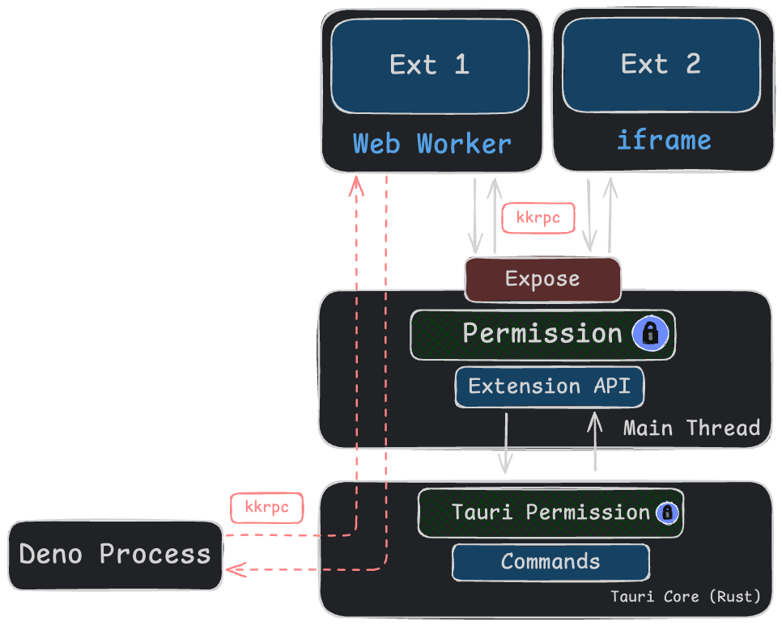

  <iframe
    width="100%"
    style="height: 100%;"
    src="https://www.youtube.com/embed/NBti-LzDTTI"
    title="Kunkun: Extension Architecture"
    frameborder="0"
    allow="accelerometer; autoplay; clipboard-write; encrypted-media; gyroscope; picture-in-picture; web-share"
    referrerpolicy="strict-origin-when-cross-origin"
    allowfullscreen
  ></iframe>

import { Image } from "astro:assets";
import KunkunExtArch from "../../../assets/design/kunkun-ext-arch.png";

<Image
  src={KunkunExtArch}
  alt="Kunkun Extension Architecture"
  style={{ minWidth: "100px", height: "auto" }}
/>

The communication between KK and the extension is done through the `kkrpc` protocol.

This is how `kkrpc` works in browser between iframe, main thread, web worker and server.

Here is how it's used in Kunkun's extension system.

