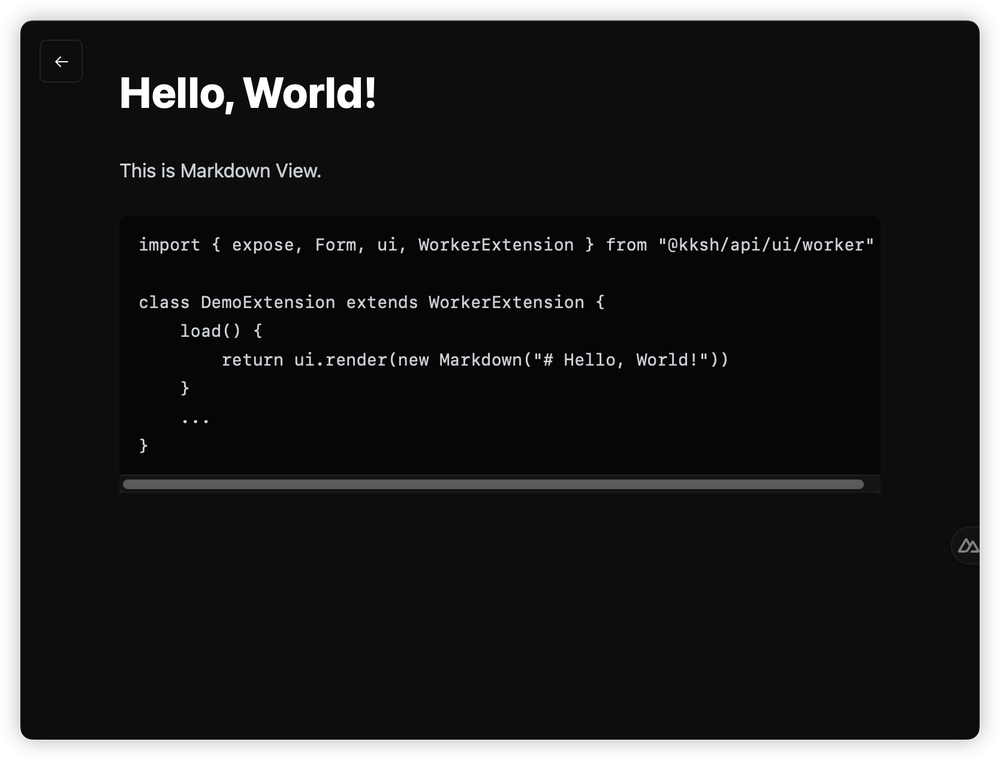
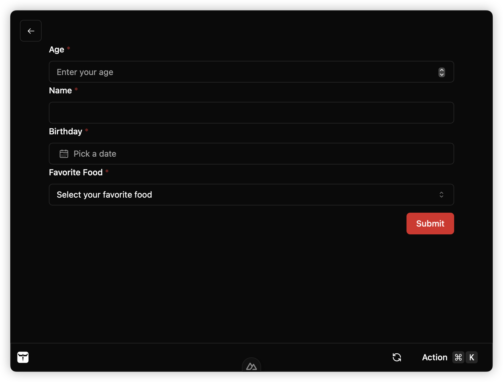
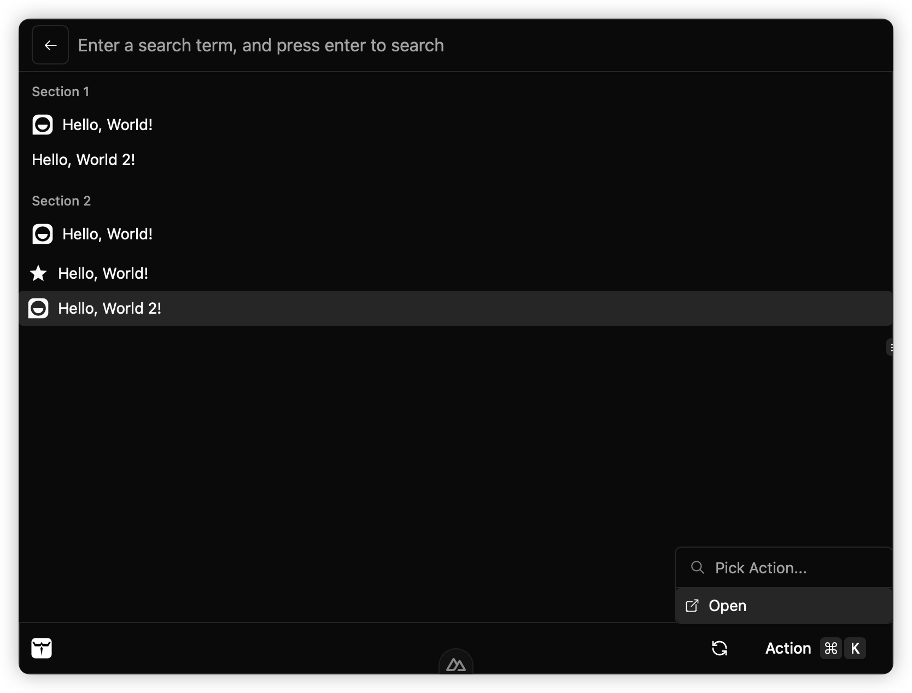

Worker Template command is a kind of lightweight extension command running in web worker (30KB+),
following pre-defined template, making it easy to develop extension with consistent GUI.

## Installation

Prerequisites:

- Node.js 20+
- [pnpm](https://pnpm.io/installation#using-corepack)
- [bun](https://bun.sh/)
  - bun is used to build extension from TypeScript into JavaScript.

Run the project scaffolding command to create a new project with Worker Template Extension.

```bash
npm init kunkun@latest  # choose the template
```

After creating a template project, you need to edit `package.json`.

## Development

### Add Dev Extension to Kunkun

import AddDevExt from "./snippets/add-dev-ext.mdx";

<AddDevExt />

### Edit Manifest

KK uses `package.json` to define an extension.

See [Manifest](/developer/manifest/) for more details.

You need to edit the name, description, identifier and icon of your extension.

:::danger
Make sure the identifier is the same as the extension folder name.

KK uses the identifier to find the extension folder.

If they are not the same, the extension will not be published.
:::

#### Permissions

KK provides many APIs within `@kksh/api` package. See [API Docs](/developer/api/api/) for more details.

Most of them requires adding corresponding permissions in `package.json`.

For example, if you want to read clipboard text, you need to add `clipboard:read-text` permission in `package.json`, under `kunkun.permissions` field.

See [Extension Permissions](/extensions/security/permissions/) for a full list of permissions, and API docs for each API to see how to add permissions.

Some permissions are just a single string, some are scoped permissions.

### Start Coding

It is recommended to use pnpm for development because when the extension is built in our CI, it is also built with pnpm.

```bash
pnpm install
pnpm build # build the extension, generate dist/index.js file, this is the entry file of the extension, make sure it's listed in the package.json
pnpm dev # start the development server, basically running `build` with watch mode
```

In dev mode (`pnpm dev`), every time you save the file, the extension will be recompiled and Kunkun desktop app will be notified to reload the extension.
Otherwise you need to manually reload the extension.

A template worker extension should `extends` abstract class `TemplateUiCommand` (https://docs.api.kunkun.sh/classes/ui_worker.TemplateUiCommand)

Override the methods of this class to implement your extension.

- `load`
- `onSearchTermChange`
- `onActionSelected`
- `onEnterPressedOnSearchBar`

**List View**

- `onListItemSelected`
- `onListScrolledToBottom`
- `onHighlightedListItemChanged`

**Form View**

- `onFormSubmit`

```ts
import { expose, TemplateUiCommand } from "@kksh/api/ui/template";

class DemoExtension extends TemplateUiCommand {
  async load() {
    // load method is run when the extension is loaded, you can use it as an initializer
  }
}

expose(new DemoExtension()); // expose this extension at the bottom of the file
```

There is no concept like routing in worker template extension. Different views can be rendered with `ui.render()` method.

You can add any variables to the Extension class to keep track of the state and render different views based on the state.

Once the command is built, a js file will be generated at `dist/index.js`.

Refresh kunkun app, you should see the command.

### Advanced Usage

The scaffold template uses `bun` to build the extension from TypeScript into JavaScript.
You can install other dependencies (they need to run in web worker), add more `.ts` files.
Eventually they will be bundled into a single js file and run in web worker.

`build.ts` in the template project contains the build script, you can modify it as you want,
or replace bun with other build tools like esbuild, rollup, vite, etc.

`@rollup/plugin-terser` is known to have some problems with the current `@kksh/api` package.
`bun` is the simpliest and fastest tool for this job.

<details>
<summary>Sample Build Script</summary>

```ts
import { watch } from "fs";
import { join } from "path";
import { refreshTemplateWorkerCommand } from "@kksh/api/dev";
import { $ } from "bun";

async function build() {
  await $`bun build --minify --target=browser --outdir=./dist ./src/index.ts`;
  await refreshTemplateWorkerCommand();
}

const srcDir = join(import.meta.dir, "src");

await build();

if (Bun.argv.includes("dev")) {
  console.log(`Watching ${srcDir} for changes...`);
  watch(srcDir, { recursive: true }, async (event, filename) => {
    await build();
  });
}
```

</details>

## Views

Template Command follows templates. Each template is a type of view.

### Markdown View

Basically renders markdown on page.

```ts
import { expose, Form, ui, TemplateUiCommand } from "@kksh/api/ui/template"

class DemoExtension extends TemplateUiCommand {
	load() {
		return ui.render(new Markdown("# Hello, World!"))
	}
	...
}

expose(new DemoExtension())
```



### Form View

A form can be easily rendered with the `ui` API. Every form field is an object.

Available form fields:

- `Form.InputField`
- `Form.NumberField`
- `Form.SelectField`
- `Form.BooleanField`
- `Form.DateField`
- `Form.ArrayField`
- `Form.Form`

```ts
import { expose, Form, ui, TemplateUiCommand } from "@kksh/api/ui/template";

class DemoExtension extends TemplateUiCommand {
  async onFormSubmit(value: Record<string, any>): Promise<void> {
    console.log("Form submitted", value);
  }
  async load() {
    return ui.render(
      new Form.Form({
        key: "form1",
        fields: [
          new Form.NumberField({
            key: "age",
            label: "Age",
            placeholder: "Enter your age",
          }),
          new Form.InputField({
            key: "name",
          }),
        ],
      })
    );
  }
}
expose(new DemoExtension());
```



### List View

List view can contain sections and items. Everything is an object.

An list item can have title, value, icon and actions.
Each item can contain multiple actions. When selected, `onActionSelected()` will be called.



```ts
import {
  Action,
  expose,
  Icon,
  IconEnum,
  List,
  ui,
  TemplateUiCommand,
} from "@kksh/api/ui/template";

class DemoExtension extends TemplateUiCommand {
  async onFormSubmit(value: Record<string, any>): Promise<void> {
    console.log("Form submitted", value);
  }
  async load() {
    return ui.setSearchBarPlaceholder("Enter search term").then(() => {
      return ui.render(
        new List.List({
          sections: [
            new List.Section({
              title: "Section 1",
              items: [
                new List.Item({
                  title: "Hello, World!",
                  value: "Section 1 Hello, World!",
                  icon: new Icon({ type: IconEnum.Iconify, value: "gg:hello" }),
                }),
                new List.Item({
                  title: "Hello, World 2!",
                  value: "Section 1 Hello, World 2!",
                }),
              ],
            }),
            new List.Section({
              title: "Section 2",
              items: [
                new List.Item({
                  title: "Hello, World!",
                  value: "Section 2 Hello, World!",
                  icon: new Icon({ type: IconEnum.Iconify, value: "gg:hello" }),
                }),
              ],
            }),
          ],
          items: [
            new List.Item({
              title: "Hello, World!",
              value: "Hello, World!",
              icon: new Icon({
                type: IconEnum.Iconify,
                value: "ri:star-s-fill",
              }),
            }),
            new List.Item({
              title: "Hello, World 2!",
              value: "Hello, World 2!",
              icon: new Icon({ type: IconEnum.Iconify, value: "gg:hello" }),
              actions: new Action.ActionPanel({
                items: [
                  new Action.Action({
                    title: "Open",
                    icon: new Icon({
                      type: IconEnum.Iconify,
                      value: "ion:open-outline",
                    }),
                  }),
                ],
              }),
            }),
          ],
        })
      );
    });
  }

  async onSearchTermChange(term: string): Promise<void> {
    console.log("Search term changed to:", term);
  }

  async onItemSelected(value: string): Promise<void> {
    console.log("Item selected:", value);
  }

  async onActionSelected(value: string): Promise<void> {
    console.log("Action selected:", value);
  }
}
expose(new DemoExtension());
```

import VerifyInstructions from "./snippets/verify-instructions.mdx";

<VerifyInstructions />

## Publish

See [Guide: Extension Publish](/guides/extensions/publish/design) for more details.
