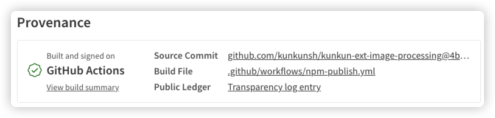
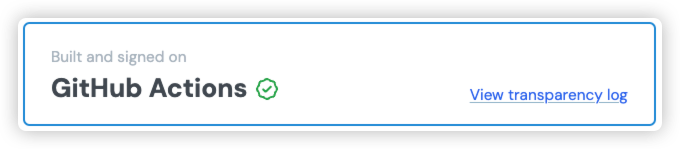

## TLDR

To publish an extension to KK's extension store, follow one of these guides:

1. [Publishing with NPM](./npm)
2. [Publishing with JSR](./jsr)

## Overview

This article explains KK's extension publishing system and its core design principles.

The system is built around two fundamental goals:

1. Open Source Transparency
2. Security Assurance

All community extensions must be open source for transparency and security. This requirement means that extensions are hosted on GitHub where they're available for public review and contribution.

While KK implements a permission control system to restrict extension capabilities, some extensions may need elevated permissions to function properly. Even with these permission controls in place, we cannot completely guarantee that an extension won't behave maliciously.

This is one key reason why we require extensions to be open source. However, open source alone doesn't ensure complete transparency and security. For example, while npm packages typically link to their GitHub source code, there's no inherent guarantee that the published package is indeed built from the source code. A malicious actor could modify code locally before publishing to npm.

To address this security gap, both npm and jsr support provenance statements. 
See
- https://docs.npmjs.com/generating-provenance-statements
- https://jsr.io/docs/trust

#### NPM Provenance

#### JSR Provenance

A provenance statement verifies the origin and authenticity of software packages. It creates a verifiable record of where the code came from, how it was built, and who contributed to it. This helps ensure transparency and detect potential security risks or supply chain vulnerabilities.

## Current Implementation

While we plan to implement a dedicated provenance system for KK's extension store in the future, we currently leverage the existing provenance systems from npm and jsr.

The current publishing process works as follows:

1. Extensions must be published to either npm or jsr via GitHub Actions
2. Developers then register their extension through our website

For detailed publishing instructions, see the following guides:
- [Publishing with NPM](./npm)
- [Publishing with JSR](./jsr)
