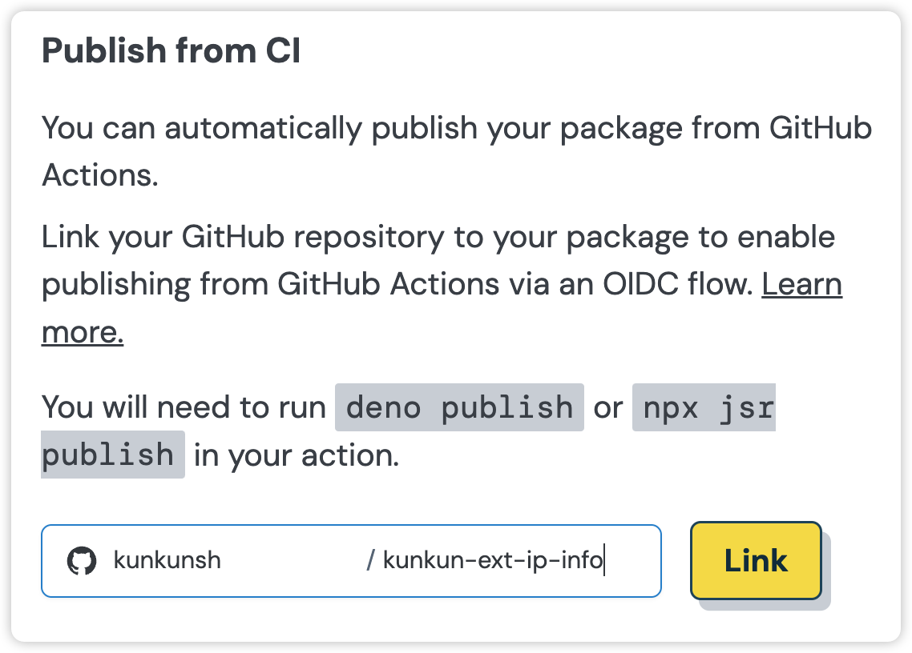

<div class="not-content">
  <iframe class="w-full h-96" src="https://www.youtube.com/embed/wPdWLsbxHpY" title="Kunkun: Publish Extension Through JSR" frameborder="0" allow="accelerometer; autoplay; clipboard-write; encrypted-media; gyroscope; picture-in-picture; web-share" referrerpolicy="strict-origin-when-cross-origin" allowfullscreen></iframe>
</div>

JSR is a new package registry for the JavaScript ecosystem.

**TLDR**

This is a very simple sample extension https://github.com/kunkunsh/kunkun-ext-ip-info.
You can use it as a template.

After developing your extension, you can publish it to JSR by following these steps:

## Create a package on `jsr.io/new`

1. Go to https://jsr.io/new, enter a scope (e.g. `kunkun`) and a package name (e.g. `kunkun-ext-ip-info`), and click "Create Package".
2. Link your GitHub repository to the package.
    


## Add a `jsr.json` file

```json title="jsr.json"
{
  "name": "@kunkun/kunkun-ext-ip-info",
  "version": "0.0.5",
  "license": "MIT",
  "exports": "./mod.ts",
  "publish": {
    "include": ["dist", "README.md", "package.json", "mod.ts"]
  }
}
```

Although you are not publishing a library, but JSR requires an `exports` field in `jsr.json`, so create an empty `mod.ts` file in the root directory of your project.

Include the files you want to publish in the `publish.include` field.

`package.json`, `mod.ts` are necessary, and don't forget to include the built artifact of your extension, e.g. `dist` or `build` folder.

## Add a GitHub Action Workflow

In order to get provenance statements for your package, you must publish it through GitHub Action. 

> Of source you can experiment with publishing your package locally with `npx jsr publish` to make sure everything works.
> After that, bump your package version and publish it through GitHub Action.
> Any package without provenance statement will be rejected by KK's extension store.

In the following sample GitHub Action Workflow file, we use `bun` for the entire workflow.
You can use whatever you like, `npm`, `node`, `pnpm`, `yarn`. 
You can even build wasm with rust and publish it to JSR.

`bunx kksh verify --publish` is an optional but recommented step. `kksh` is Kunkun's CLI tool. 
If the `verify --publish` command fails, the package will not be able to be published to KK's extension store.

:::caution
When publishing a package to JSR, make sure the version in `jsr.json` and `package.json` are the same.
This is because Kunkun only uses `package.json` as it's manifest file and use its version field, 
but the version in `jsr.json` is what is used on JSR, and during the verification process we find your package with package name and version in `jsr.json`.

`bunx kksh verify --publish` will check if the version in `jsr.json` and `package.json` are the same, so it's helpful to include it.
:::

```yaml title=".github/workflows/jsr-publish.yml"
name: JSR Publish
on:
  push:
    branches:
      - main

jobs:
  publish:
    runs-on: ubuntu-latest

    permissions:
      contents: read
      id-token: write

    steps:
      - uses: actions/checkout@v4
      - uses: oven-sh/setup-bun@v2
      - name: Install dependencies
        run: bun install
      - name: Build
        run: bun run build
      - name: Verify Package
        run: bunx kksh verify --publish
      - name: Publish package
        run: bunx jsr publish
```

:::tip
If you are using monorepo, your root of extension package may not be the root of your repository.
Then in GitHub Action you can use `working-directory: ./path-to-extension` under step to tell `jsr` which directory to publish.
:::

## Register your Extension

Go to https://kunkun.sh/dashboard/publish-extension/jsr, enter your jsr scope.
All your packages will be listed, select the one you want to publish to KK's extension store.

Make sure you login with GitHub, it needs to verify the ownership of the package.

