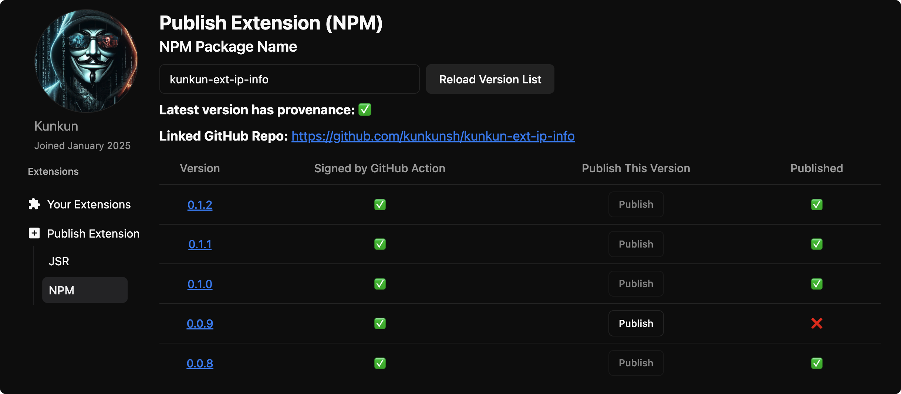

NPM is the most popular package manager for JavaScript.

After developing your extension, you can publish it to JSR by following these steps:

## Obtain NPM Access Token

Read https://docs.npmjs.com/creating-and-viewing-access-tokens

Obtain an NPM access token and store it in your GitHub repository secrets. [Docs](https://docs.github.com/en/actions/security-for-github-actions/security-guides/using-secrets-in-github-actions)

## Create a package on NPM

Suppose your extension will generate a `dist` folder after building.

1. Make sure your `package.json`'s `files` field includes the `dist` folder as well as everything else you want to publish.
2. Make sure your `package.json` has a `license` field with a valid license like `MIT`.
3. Make sure your `package.json` has a `repository` field with a valid GitHub repository URL. (e.g. `"repository": "https://github.com/kunkunsh/kunkun-ext-video-processing",`)
   - This repo url is necessary for the provenance statement.
4. `name` in `package.json` is recommended to start with `kunkun-ext` (no strict requirement).
5. `npm login` and `npm publish`

Then your package should be available on NPM. `https://www.npmjs.com/package/<package name>`

You may not be able to find it on NPM by searching for it, but you can access it directly by URL.

## Add a GitHub Action Workflow

Make sure `npm publish --provenance` command has the `--provenance` flag. Otherwise provenance statements won't be generated.

Make sure `NPM_TOKEN` is assigned to `NODE_AUTH_TOKEN` environment variable during the publish step.

```yaml title=".github/workflows/npm-publish.yml"
name: NPM Package Publish

on:
  workflow_dispatch:

jobs:
  publish-npm:
    runs-on: ubuntu-latest
    permissions:
      contents: read
      id-token: write
    steps:
      - uses: actions/checkout@v4
      - uses: oven-sh/setup-bun@v2
      - run: bun install
      - run: bun run build
      - name: Publish to NPM
        run: npm publish --provenance --access public
        env:
          NODE_AUTH_TOKEN: ${{secrets.NPM_TOKEN}}
```

`workflow_dispatch:` means you have to go to GitHub Action tab in your repo and manually trigger the workflow.

You can configure it to run on **release created** event or **push event** to main branch.

If you let it trigger on push, publishing duplicate version to npm will fail.

To prevent this, you can check the version of the package in the npm registry before publishing.
Here is an example of how to do this:

```yaml title=".github/workflows/npm-publish.yml"
name: NPM Package Publish

on:
  push:
    branches: [main]
  release:
    types: [created]
  workflow_dispatch:

jobs:
  publish-npm:
    runs-on: ubuntu-latest
    permissions:
      contents: read
      id-token: write
    steps:
      - uses: actions/checkout@v4
      - uses: oven-sh/setup-bun@v2
      - run: bun install
      - run: bun run build
      - name: Check if version is already published
        run: |
          PACKAGE_VERSION=$(node -p "require('./package.json').version")
          npm view <package-name>@$PACKAGE_VERSION
        continue-on-error: true
        id: check_version
      - name: Publish
        if: steps.check_version.outcome != 'success'
        run: npm publish --provenance --access public
        env:
          NODE_AUTH_TOKEN: ${{secrets.NPM_TOKEN}}
```

## Register your Extension

Go to https://kunkun.sh/dashboard/publish-extension/npm, enter your npm package name.

Make sure you login with GitHub, it needs to verify the ownership of the package.


