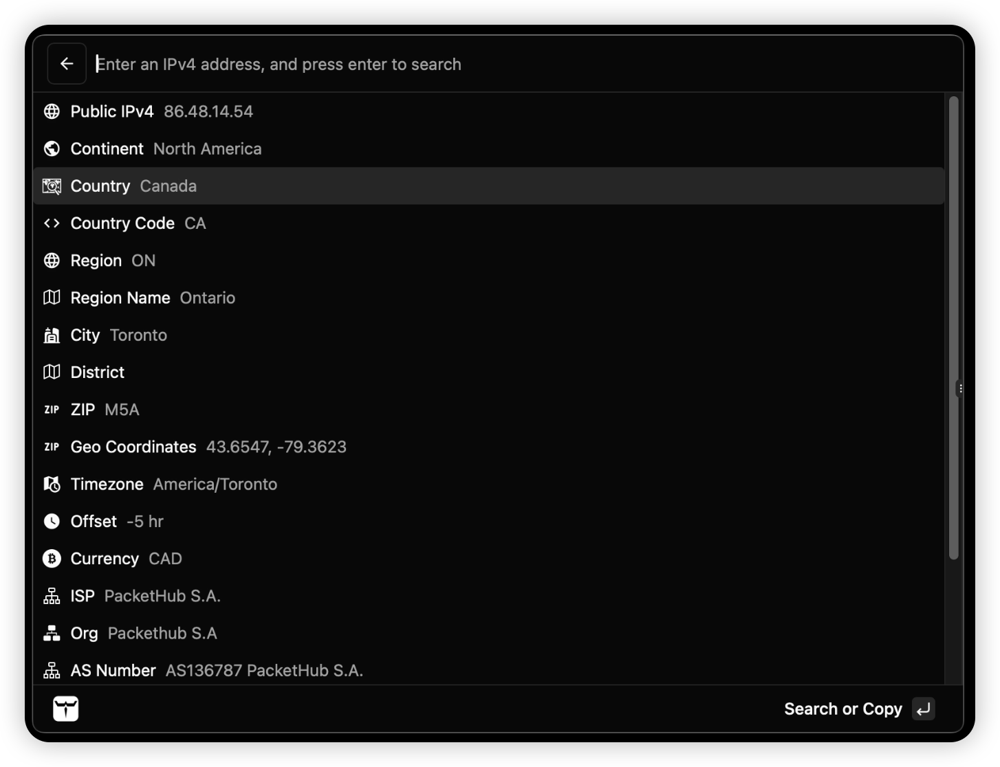

In the demo video below, I discussed the following:

- What is Kunkun?
- Why was is created?
  - Open Source
  - Cross-platform
  - Security and Privacy (achieved with a strict permission model)
  - More flexible (with web technologies, like Svelte)
- How to use it?

<video src="https://storage.kunkun.sh/kunkun-demo.mp4" controls></video>

:::tip
See [YouTube Playlist](https://www.youtube.com/playlist?list=PLUxw2JoWliirhQROHwpa0yMEYiUHoGw2_) for more videos.
:::

## Installation

Download Kunkun's installer from https://kunkun.sh/download.

:::caution
Although installer for Windows and Linux are available, they are not yet fully tested and have compatibility issues.
It's recommended to use Mac for the best experience.
:::

On Mac, if it asks for password to access keychain, you can select "Always Allow". I will explain.

It uses system keychain to store a randomly generated password to encrypt sqlite database,
instead of using the same encryption key on everyone's machine.
Storing the password in a regular file would be a security risk.
Even with obfuscation or encryption,
it's still possible to reverse engineer the binary to get the password.
System keychain is the most secure way to store the password,
but requires user to enter password when the app updates.

## Features

1. Key Displayer: Display the keys pressed on the keyboard.
2. Clipboard history
3. File Transfer (send files to other devices in local network with Kunkun installed)
   1. Support files and folders
   2. If you don't have another computer in local network, you can try to send files to your own computer
4. Store (install extensions from the store)

## Screenshots

### Extension Store

### Clipboard History

### Disk Speed

### File Transfer

### Generate QR Code

### Hacker News

### Image Info

### IP Info

### JWT Viewer

### Key Displayer

### Letterboxd Movie Search

### Git Skyline with Transparent Window

### Video Conversion

### Video Info

### Extension Permission Disclaimer

